## 1 经典算法面试题

1. 字符串匹配问题：

   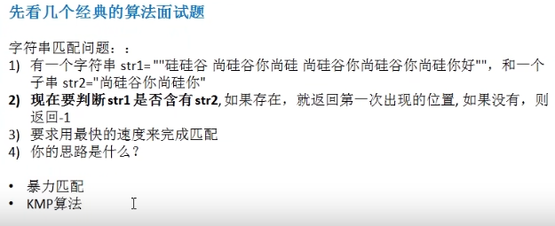

2. 汉诺塔游戏

   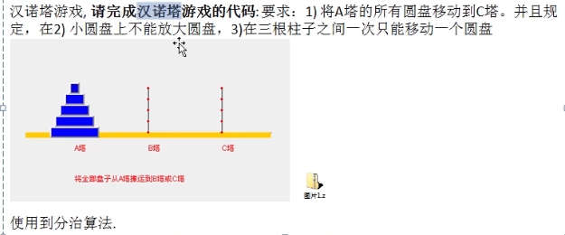

3. 八皇后问题

   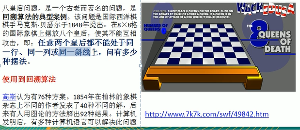

4. 马踏棋盘算法

   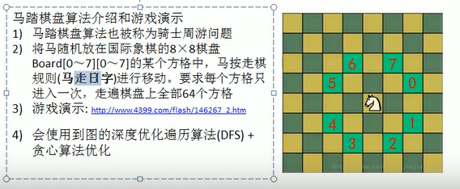

## 2 数据结构和算法的重要性

1. 算法是程序的灵魂，优秀的程序可以在海量数据计算时，依然保持高速
2. 一般来说，程序会使用了内存计算框架（比如Spark）和缓存技术（比如Redis等）来优化程序，再深入的思考一下，这些计算框架和缓存技术，它的核心功能是哪个部分呢？
3. 在Unix下开发服务器，功能是要支持上千万人同时在线，再上线前，做内测，一切OK，可上线后，服务器就支撑不住了，公司的CTO对代码进行优化，再次上线，坚如磐石。你就能感受到程序是有灵魂的，就是算法。
4. 目前程序员的面试的门槛越来越高，很多一线IT公司，都会有数据结构和算法的面试题。
5. 如果不想永远都是代码工人，那就花时间来研究下数据结构和算法

## 3 数据结构和算法的关系

- 数据结构是一门研究组织数据方式的学科，有了编程语言也就有了数据结构。学好数据结构可以编写出更加漂亮，更加有效率的代码。
- 要学好数据结构就要多多考虑如何将生活中遇到的问题，用程序去实现解决。
- 程序=算法+数据结构。
- 数据结构是算法的基础，换言之，要想学号算法，需要把数据结构学到位。

## 4 线性结构和非线性结构

### 4.1 线性结构

1. 线性结构作为最常用的数据结构，其特点是数据元素之间存在一对一的线性关系
2. 线性结构有两种不同的存储结构，即顺序存储结构和链式存储结构。顺序存储的线性表称为顺序表，**顺序表中的存储元素是（地址）连续的**
3. 链式存储结构的线性表称为链表，链表中的存储元素不一定是连续的，元素节点中存放数据元素以及相邻元素的地址信息
4. 线性结构常见的有：数组、队列、链表和栈

### 4.2 非线性结构

非线性结构包括：二维数组、多维数组、广义表、树、图

## 5 稀疏矩阵

当一个数组中大部分元素为0，或者为同一个值的数组时，可以使用稀疏数组来保存该数组。

稀疏数组的处理方法是：

1. 记录数组一共有几行几列，有多少个不同的值
2. 把具有不同值的元素的行列及值记录在一个小规模的数组中，从而缩小程序的规模

### 5.1 应用场景

棋盘存档

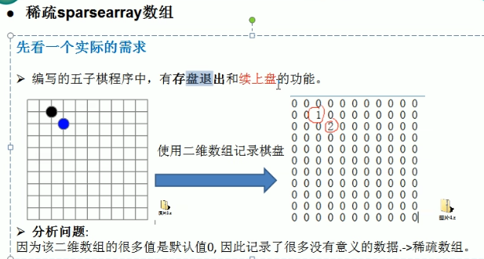

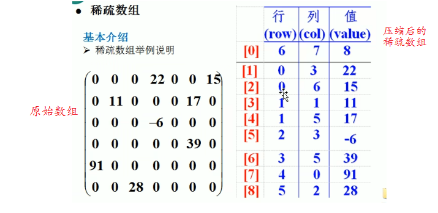

### 5.2 实例应用

1. 使用稀疏数组，来保留类似前面的二维数组（棋盘、地图等等）

2. 把稀疏数组存盘，并且可以重新恢复原来的二维数组

3. 整体思路分析

   1. 二维数组 转 稀疏数组的思路
      1. 遍历原始的二维数组，得到有效数据的个数sum
      2. 根据sum就可以创建稀疏数组`sparseArr int[sum+1][3]`
      3. 将二维数组的有效数据存入到稀疏数组
   2. 稀疏数组转原始的二维数组的思路
      1. 先读取稀疏数组的第一行，根据第一行的数据，创建原始的二维数组
      2. 再读取稀疏数组后几行的数据，并赋给原始的二维数组即可

4. 代码实现

   ```java
   	/*数组压缩成稀疏矩阵*/
       @Test
       public void compress() {
           /*
           创建一个原始的二维数组11*11
           0表示没有棋子，1表示黑子，2表示蓝子
            */
           int chessArr[][] = new int[11][11];
           chessArr[1][2] = 1;
           chessArr[2][3] = 2;
           /*输出原有数组*/
           System.out.println("二维数组：");
           for (int[] row : chessArr) {
               for (int data : row) {
                   System.out.printf("%d\t", data);
               }
               System.out.println();
           }
           /*对数组进行压缩*/
           int sum = 0; //有效数据个数
           for (int[] row : chessArr) {
               for (int data : row) {
                   if (data != 0) {
                       sum += 1;
                   }
               }
           }
   
           /*创建稀疏矩阵*/
           int sparseArr[][] = new int[sum + 1][3];
           sparseArr[0][0] = chessArr.length;
           sparseArr[0][1] = chessArr[0].length;
           sparseArr[0][2] = sum;
           int row = 0;
           for (int i = 0; i < chessArr.length; i++) {
               for (int j = 0; j < chessArr[0].length; j++) {
                   if (chessArr[i][j] != 0) {
                       row++;
                       sparseArr[row][0] = i;
                       sparseArr[row][1] = j;
                       sparseArr[row][2] = chessArr[i][j];
                   }
               }
           }
   
           /*输出稀疏数组*/
           System.out.println("稀疏数组：");
           for (int[] row2 : sparseArr) {
               for (int data : row2) {
                   System.out.printf("%d\t", data);
               }
               System.out.println();
           }
   
           /*将稀疏矩阵转为二维数组*/
           int chessArr02[][] = new int[sparseArr[0][0]][sparseArr[0][1]];
           for (int i = 1; i < sparseArr.length; i++) {
               chessArr02[sparseArr[i][0]][sparseArr[i][1]] = sparseArr[i][2];
           }
           System.out.println("稀疏数组转二维数组：");
           for (int[] row3 : chessArr02) {
               for (int data : row3) {
                   System.out.printf("%d\t", data);
               }
               System.out.println();
           }
       }
   ```

### 5.3 课后习题

**要求：**

1. 在前面的基础上，将稀疏矩阵保存到磁盘上，比如map.data
2. 恢复原来的数组时，读取map.data进行恢复

## 6 队列

### 6.1 应用场景

银行排队叫号

### 6.2 队列介绍

- 队列是一个有序列表，可以用数组或是链表来实现

- 遵循先进先出的原则。即：先存入队列的数据，要先取出。后存入的要后取出

- 示意图：（使用数组模拟队列）

  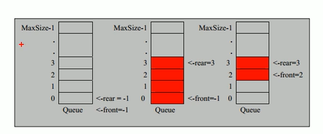

### 6.3 数组模拟队列

- 队列本身是有序列表，若使用数组的结构来存储队列的数据，则队列数据的声明如上图，其中MaxSize是该队列的最大容量。
- 因为队列的输出、输入分别是从前后端来处理，因此需要两个变量front及rear分别记录队列的前后端的下标；front会随着数据输出而改变，而rear则随着数据输入而改变。

**当我们将数据存入队列时称为“”addQueue",addQueue的处理需要有两个步骤，思路分析：**

1. 将尾指针往后移：rear+1。当front==rear，为空
2. 若尾指针rear小于队列的最大下标maxSize-1，则将数据存入到所指的数组元素中，否则无法存入数据。rear==maxSize-1，队列满 

**代码实现：**

```java
package com.company.queue;

public class ArrayQueueDemo {
    public static void main(String[] args) {

    }
}

class ArrayQueue {
    private int maxSize;
    private int rear;
    private int front;
    private int[] array;

    public ArrayQueue(int maxSize) {
        this.maxSize = maxSize;
        rear = -1;
        front = -1;
        array = new int[this.maxSize];
    }

    public boolean isFull() {
        return rear == maxSize - 1;
    }

    public boolean isEmpty() {
        return rear == front;
    }

    /*添加数据到队列*/
    public void enQueue(int n) {
        if (isFull()) {
            System.out.println("queue is Full");
            return;
        }
        rear++;
        array[rear] = n;
    }

    /*出队*/
    public int outQueue() {
        if (isEmpty()) {
            System.out.println("queue is empty");
            System.exit(-1);
        }
        front++;
        return array[front];
    }

    /*显示队列*/
    public void showQueue() {
        if (isEmpty()) {
            System.out.println("queue is empty");
            System.exit(-1);
        }
        for (int i = 0; i < array.length; i++) {
            System.out.printf("array[%d]=%d\n", i, array[i]);
        }
    }

    /*获取队列头元素*/
    public int getHead() {
        if (isEmpty()) {
            System.out.println("queue is empty");
            System.exit(-1);
        }
        return array[front + 1];
    }
}
```

### 6.4 数组模拟环形队列

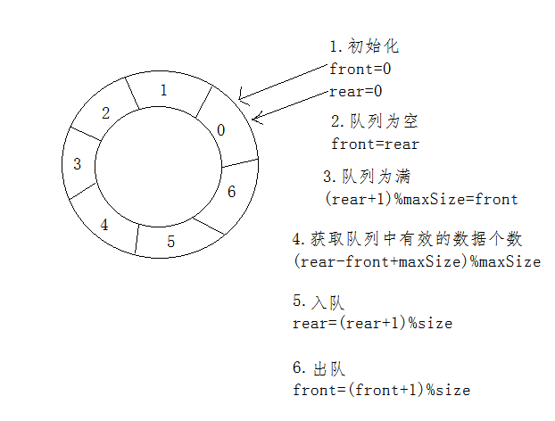

**代码实现：**

```java
package com.company.queue;

public class CircleArrayQueueDemo {
    public static void main(String[] args) {
        CircleArrayQueue circleArrayQueue = new CircleArrayQueue(4);
        circleArrayQueue.enQueue(10);
        circleArrayQueue.enQueue(20);
        circleArrayQueue.enQueue(30);
        circleArrayQueue.showQueue();
    }
}

//环形队列
class CircleArrayQueue {
    private int maxSize;
    private int[] array;
    private int front;
    private int rear;

    public CircleArrayQueue(int maxSize) {
        this.maxSize = maxSize;
        array = new int[maxSize];
        front = 0;
        rear = 0;
    }

    public boolean isFull() {
        return (rear + 1) % maxSize == front;
    }

    public boolean isEmpty() {
        return rear == front;
    }

    public int size() {
        return (rear - front + maxSize) % maxSize;
    }

    /*入队*/
    public void enQueue(int n) {
        if (isFull()) {
            System.out.println("circle is full");
            System.exit(-1);
        }
        array[rear] = n;
        rear = (rear + 1) % maxSize;
    }

    /*出队*/
    public int outQueue() {
        if (isEmpty()) {
            System.out.println("circle queue is empty");
            System.exit(-1);
        }
        int temp = array[front];
        front = (front + 1) % maxSize;
        return temp;
    }

    /*显示队列元素*/
    public void showQueue() {
        if(isEmpty()){
            System.out.println("circle queue is empty");
            System.exit(-1);
        }
        for (int i = front; i < front + size(); i++)
            System.out.printf("array[%d]=%d\n", i % maxSize, array[i%maxSize]);
    }


    /*获取头元素*/
    public int getHead() {
        if(isEmpty()){
            System.out.println("circle queue is empty");
            System.exit(-1);
        }
        return array[front];
    }

}
```

## 7 链表

### 7.1 单链表

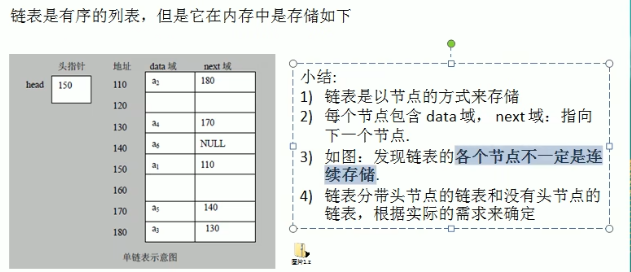

#### 7.1.1 单链表代码实现

```java
package com.company.link;

public class SingleLinkedListDemo {
    public static void main(String[] args) {
        SingleLinkedList list = new SingleLinkedList();
        list.add(new HeroNode(1,"A","AA"));
        list.add(new HeroNode(2,"B","BB"));
        list.add(new HeroNode(3,"C","CC"));
        list.list();
    }
}

class SingleLinkedList {
    private HeroNode head = new HeroNode(0, "", "");

    /*添加结点*/
    public void add(HeroNode heroNode) {
        HeroNode tempNode = head;
        while (tempNode.next != null) {
            tempNode = tempNode.next;
        }
        tempNode.next = heroNode;
    }

    /*遍历链表*/
    public void list() {
        if (isEmpty()) {
            System.out.println("list is empty");
            System.exit(-1);
        }
        HeroNode tempNode = head.next;
        while (true) {
            if (tempNode == null) {
                break;
            }
            System.out.println(tempNode);
            tempNode = tempNode.next;
        }
    }

    public boolean isEmpty() {
        return head.next == null;
    }
}

/*单链表结点*/
class HeroNode {
    private int id;
    private String name;
    private String nickname;
    HeroNode next;

    HeroNode(int id, String name, String nickname) {
        this.id = id;
        this.name = name;
        this.nickname = nickname;
    }

    @Override
    public String toString() {
        return "HeroNode{" +
                "id=" + id +
                ", name='" + name + '\'' +
                ", nickname='" + nickname + '\'' +
                '}';
    }
}

```

#### 7.1.2 顺序插入结点

```java
/*顺序添加,不能重复添加编号*/
    public void addByOrder(HeroNode heroNode) {
        HeroNode tempNode = head;
        boolean flag = false; //编号是否重复
        while (true) {
            /*位于链表尾*/
            if (tempNode.next == null) {
                break;
            }
            if (tempNode.next.id > heroNode.id) {
                break;
            } else if (tempNode.next.id == heroNode.id) {
                flag = true;
                break;
            }
            tempNode = tempNode.next;
        }
        if (flag) {
            System.out.println("编号" + heroNode.id + "已经存在");
            System.exit(-1);
        } else {
            heroNode.next = tempNode.next;
            tempNode.next = heroNode;
        }
    }
```

#### 7.1.3 修改节点信息

```java
/*根据 id 修改结点信息 */
    public void modify(HeroNode heroNode) {
        if (isEmpty()) {
            System.out.println("list is Empty");
            System.exit(-1);
        }
        HeroNode tempNode = head.next;
        boolean flag = false;
        while (true) {
            if (tempNode == null) {
                break;
            }
            if (tempNode.id == heroNode.id) {
                flag = true;
                break;
            }
            tempNode = tempNode.next;
        }
        if (flag) {
            tempNode.name = heroNode.name;
            tempNode.nickname = heroNode.nickname;
        } else {
            System.out.println("该节点不存在");
        }
    }
```

#### 7.1.4 删除节点

```java
/*删除节点*/
public void delete(int id) {
    if (isEmpty()) {
        System.out.println("list is Empty");
        System.exit(-1);
    }
    HeroNode tempNode = head;
    boolean flag = false;
    while (true) {
        if (tempNode.next == null) {
            break;
        }
        if (tempNode.next.id == id) {
            flag = true;
            break;
        }
        tempNode = tempNode.next;
    }
    if (flag) {
        tempNode.next = tempNode.next.next;
    }else{
        System.out.println("要删除的节点不存在！");
    }
}
```

#### 7.1.5 单链表面试题

1. 求单链表中有效节点的个数

   ```java
   /*求单链表中有效节点的个数*/
   public int getLength() {
       if (isEmpty()) {
           System.out.println("list is empty");
           return -1;
       }
       int length = 0;
       HeroNode tempNode = head;
       while (true) {
           if (tempNode.next == null) {
               break;
           }
           length++;
           tempNode = tempNode.next;
       }
       return length;
   }
   ```

2. 查找单链表中的倒数第k个节点

   ```java
   /*查找单链表中的倒数第k个节点*/
   public HeroNode findLastIndexNode(int index) {
       if (isEmpty()) {
           System.out.println("list is empty");
           return null;
       }
   
       int size = getLength();
       if (index <= 0 || index > size) {
           System.out.println("index is invalid");
           return null;
       }
       HeroNode tempNode = head.next;
       for (int i = 0; i < size - index; i++) {
           tempNode = tempNode.next;
       }
       return tempNode;
   }
   ```

3. 单链表的反转

   ```java
   /*链表反转*/
   public void reverse(HeroNode heroNode) {
       if (heroNode.next == null) {
           System.out.println("list is empty");
           System.exit(-1);
       }
       HeroNode curNode = heroNode.next;
       HeroNode nextNode = null;
       HeroNode reverseNode = new HeroNode(0, "", "");
       while (curNode != null) {
           nextNode = curNode.next;
           curNode.next = reverseNode.next;
           reverseNode.next = curNode;
           curNode = nextNode;
       }
       heroNode.next = reverseNode.next;
   }
   ```

4. 从尾到头打印单链表【百度，要求方式1：反向遍历。方式2：Stack栈】

   ```java
   /*从尾到头打印单链表【百度，要求方式1：反向遍历。方式2：Stack栈】
    * 不建议使用方式1
    * */
   public void printTailToHead(HeroNode heroNode) {
       if (heroNode.next == null) {
           System.out.println("list is empty");
           System.exit(-1);
       }
       Stack<HeroNode> stack = new Stack<>();
       HeroNode tempNode = heroNode.next;
       while (true) {
           if (tempNode == null) {
               break;
           }
           stack.push(tempNode);
           tempNode = tempNode.next;
       }
       while (!stack.empty()) {
           System.out.println(stack.pop());
       }
   }
   ```

5. 合并两个有序的单链表，合并之后的链表依然有序

   

### 7.2 双向链表

```java
package com.company.link;

import java.util.Stack;

public class DoubleSingleLinkedListDemo {
    public static void main(String[] args) {
        DoubleSingleLinkedList list = new DoubleSingleLinkedList();
        list.add(new DuHeroNode(1, "A", "AA"));
        list.add(new DuHeroNode(3, "C", "CC"));
        list.add(new DuHeroNode(2, "B", "BB"));
        list.list();
        System.out.println();
        //顺序添加
        list.addByOrder(new DuHeroNode(5, "A", "AA"));
        list.addByOrder(new DuHeroNode(4, "C", "CC"));
        list.addByOrder(new DuHeroNode(6, "B", "BB"));
        list.list();

        System.out.println();
        //删除节点
        list.delete(5);
        list.delete(4);
        list.delete(6);
        list.list();


        //逆序打印链表
//        list.list();

//        list.reverse(list.getHead());
//        list.list();
    }
}

class DoubleSingleLinkedList {
    private DuHeroNode head = new DuHeroNode(0, "", "");

    /*获取头节点*/
    public DuHeroNode getHead() {
        return head;
    }

    /*添加结点,链尾添加*/
    public void add(DuHeroNode duHeroNode) {
        DuHeroNode tempNode = head;
        while (tempNode.next != null) {
            tempNode = tempNode.next;
        }
        tempNode.next = duHeroNode;
        duHeroNode.pre = tempNode;

    }

    /*顺序添加,不能重复添加编号*/
    public void addByOrder(DuHeroNode duHeroNode) {
        DuHeroNode tempNode = head;
        boolean flag = false; //编号是否重复
        while (true) {
            /*位于链表尾*/
            if (tempNode.next == null) {
                break;
            }
            if (tempNode.next.id > duHeroNode.id) {
                break;
            } else if (tempNode.next.id == duHeroNode.id) {
                flag = true;
                break;
            }
            tempNode = tempNode.next;
        }
        if (flag) {
            System.out.println("编号" + duHeroNode.id + "已经存在");
            System.exit(-1);
        } else {
//            duHeroNode.next = tempNode.next;
//            tempNode.next = duHeroNode;
            if (tempNode.next == null) {
                tempNode.next = duHeroNode;
                duHeroNode.pre = tempNode;
            } else {
                tempNode.next.pre = duHeroNode;
                duHeroNode.pre = tempNode;
                duHeroNode.next = tempNode.next;
                tempNode.next = duHeroNode;
            }
        }
    }

    /*根据 id 修改结点信息 */
    public void modify(DuHeroNode duHeroNode) {
        if (duHeroNode.next == null) {
            System.out.println("list is Empty");
            System.exit(-1);
        }
        DuHeroNode tempNode = head.next;
        boolean flag = false;
        while (true) {
            if (tempNode == null) {
                break;
            }
            if (tempNode.id == duHeroNode.id) {
                flag = true;
                break;
            }
            tempNode = tempNode.next;
        }
        if (flag) {
            tempNode.name = duHeroNode.name;
            tempNode.nickname = duHeroNode.nickname;
        } else {
            System.out.println("该节点不存在");
        }
    }

    /*删除节点*/
    public void delete(int id) {
        if (isEmpty()) {
            System.out.println("list is Empty");
            System.exit(-1);
        }
        DuHeroNode tempNode = head.next;
        boolean flag = false;
        while (true) {
            if (tempNode == null) {
                break;
            }
            if (tempNode.id == id) {
                flag = true;
                break;
            }
            tempNode = tempNode.next;
        }
        if (flag) {
            if (tempNode.next == null) {
                tempNode.pre.next = tempNode.next;
                tempNode.pre = null;
            } else {
                tempNode.pre.next = tempNode.next;
                tempNode.next.pre = tempNode.pre;
            }
        } else {
            System.out.println("要删除的节点不存在！");
        }
    }

    /*求单链表中有效节点的个数*/
    public int getLength() {
        if (isEmpty()) {
            System.out.println("list is empty");
            return -1;
        }
        int length = 0;
        DuHeroNode tempNode = head;
        while (true) {
            if (tempNode.next == null) {
                break;
            }
            length++;
            tempNode = tempNode.next;
        }
        return length;
    }

    /*查找单链表中的倒数第k个节点*/
    public DuHeroNode findLastIndexNode(int index) {
        if (isEmpty()) {
            System.out.println("list is empty");
            return null;
        }

        int size = getLength();
        if (index <= 0 || index > size) {
            System.out.println("index is invalid");
            return null;
        }
        DuHeroNode tempNode = head.next;
        for (int i = 0; i < size - index; i++) {
            tempNode = tempNode.next;
        }
        return tempNode;
    }

    /*链表反转*/
    /*public void reverse(HeroNode heroNode) {
        if (heroNode.next == null) {
            System.out.println("list is empty");
            System.exit(-1);
        }
        HeroNode curNode = heroNode.next;
        HeroNode nextNode = null;
        HeroNode reverseNode = new HeroNode(0, "", "");
        while (curNode != null) {
            nextNode = curNode.next;
            curNode.next = reverseNode.next;
            reverseNode.next = curNode;
            curNode = nextNode;
        }
        heroNode.next = reverseNode.next;
    }*/

    /*从尾到头打印单链表【百度，要求方式1：反向遍历。方式2：Stack栈】
     * 不建议使用方式1
     * */
    public void printTailToHead(HeroNode heroNode) {
        if (heroNode.next == null) {
            System.out.println("list is empty");
            System.exit(-1);
        }
        Stack<HeroNode> stack = new Stack<>();
        HeroNode tempNode = heroNode.next;
        while (true) {
            if (tempNode == null) {
                break;
            }
            stack.push(tempNode);
            tempNode = tempNode.next;
        }
        while (!stack.empty()) {
            System.out.println(stack.pop());
        }
    }

    /*遍历链表*/
    public void list() {
        if (isEmpty()) {
            System.out.println("list is empty");
            System.exit(-1);
        }
        DuHeroNode tempNode = head.next;
        while (true) {
            if (tempNode == null) {
                break;
            }
            System.out.println(tempNode);
            tempNode = tempNode.next;
        }
    }

    public boolean isEmpty() {
        return head.next == null;
    }
}

class DuHeroNode {
    int id;
    String name;
    String nickname;
    DuHeroNode next;
    DuHeroNode pre;

    DuHeroNode(int id, String name, String nickname) {
        this.id = id;
        this.name = name;
        this.nickname = nickname;
    }

    @Override
    public String toString() {
        return "DuHeroNode{" +
                "id=" + id +
                ", name='" + name + '\'' +
                ", nickname='" + nickname + '\'' +
                '}';
    }
}
```

### 7.3 单向环形链表

#### 7.3.1 约瑟夫问题

```java
package com.company.link;

public class Josepho {
    public static void main(String[] args) {
        CircleSingleLinkedList list = new CircleSingleLinkedList();
//        list.addBoy(6);
        list.countBoy(2, 3, 6);
//        list.showBoy();


    }
}

class CircleSingleLinkedList {
    private Boy first = null;

    public void addBoy(int nums) {
        if (nums < -1) {
            System.out.println("nums值不正确");
            return;
        }
        Boy curBoy = null;
        for (int i = 1; i <= nums; i++) {
            Boy boy = new Boy(i);
            if (first == null) {
                first = boy;
                first.setNext(first);
                curBoy = first;
            } else {
                curBoy.setNext(boy);
                boy.setNext(first);
                curBoy = boy;
            }
        }
    }

    //展示循环链表
    public void showBoy() {
        if (first == null) {
            System.out.println("循环链表为空");
            return;
        }
        Boy curBoy = first;
        while (true) {
            System.out.println(curBoy.getNo());
            if (curBoy.getNext() == first) {
                break;
            }
            curBoy = curBoy.getNext();
        }
    }

    /**
     * 约瑟夫问题
     *
     * @param startNo 开始数数的节点
     * @param countNo 间隔几个出队
     * @param nums    总孩子个数
     */
    public void countBoy(int startNo, int countNo, int nums) {
        addBoy(nums);
        if (first == null || startNo < 1 || startNo > nums) {
            System.out.println("链表为空或者startNo不合法");
            return;
        }
        Boy helper = first.getNext();
        while (true) {
            if (helper.getNext() == first) {
                break;
            }
            helper = helper.getNext();
        }

        for (int i = 0; i < startNo - 1; i++) {
            first = first.getNext();
            helper = helper.getNext();
        }
        while (true) {
            //只剩一个节点
            if (helper == first) {
                break;
            }
            for (int i = 0; i < countNo - 1; i++) {
                first = first.getNext();
                helper = helper.getNext();
            }
            System.out.println("小孩"+first.getNo()+"出圈");
            first = first.getNext();
            helper.setNext(first);
        }
        System.out.println("留在队中的小孩" + first.getNo());
    }
}

class Boy {
    private int no;
    private Boy next;

    Boy(int no) {
        this.no = no;
    }

    public int getNo() {
        return no;
    }

    public void setNo(int no) {
        this.no = no;
    }

    public Boy getNext() {
        return next;
    }

    public void setNext(Boy next) {
        this.next = next;
    }

    @Override
    public String toString() {
        return "Boy{" +
                "no=" + no +
                '}';
    }
}
```

## 8 栈

### 8.1 栈的一个实际需求

请输入一个表达式，计算式：[7*2*2-5+1-5+3-3]，点击计算

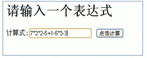

请问：计算机底层是如何运算得到结果的？注意不是简单的把运算式列出运算，因为我们看到这个算式

`7*2*2-5`,但是计算机是怎么理解这个算式的（对计算机而言，他接受到的就是一个字符串），我们讨论的是这个问题。->栈

### 8.2 栈的介绍

1. 栈的英文名为（stack）
2. 栈是一个先进后出（FILO-First In Last Out）的有序列表
3. 栈是限制线性表中元素的插入和删除只能在线性表的同一端进行的一种特殊线性表。允许插入和删除的一端，为变化的一端，称为栈顶，另一端为固定的一端，称为栈底。
4. 根据栈的定义可知，最先放入栈中元素在栈底，最后放入的元素在栈底，而删除元素刚好相反，最后放入的元素最先删除，最先放入的元素最后删除。

### 8.3 栈的应用场景

1. 子程序的调用：在跳出子程序前，会将下个指令的地址存到堆栈中，直到子程序执行完成后再将地址取出，以回到原来的程序中。
2. 处理递归调用：和子程序的调用类似，只是除了存储下一个指令的地址外，也将参数、区域变量等数据存入堆栈中。
3. 表达式的转换【中缀表达式转后缀表达式】与求值。
4. 二叉树的遍历。
5. 图形的深度优先（depth-first）搜索法。

### 8.4 数组栈代码实现

```java
package com.company.stack;

public class ArrayStackDemo {
    public static void main(String[] args) {
        ArrayStack stack = new ArrayStack(10);
        stack.push(1);
        stack.push(4);
        stack.push(3);
        stack.push(2);
        stack.push(7);
        stack.push(6);
        stack.push(9);

        System.out.println(stack.pop());
        System.out.println();

        
        stack.list();
    }
}

class ArrayStack {
    private int maxSize;
    private int[] stack;
    private int top = -1;

    ArrayStack(int maxSize) {
        this.maxSize = maxSize;
        stack = new int[maxSize];
    }

    public boolean isFull() {
        return maxSize - 1 == top;
    }

    public boolean isEmpty() {
        return top == -1;
    }

    //入栈
    public void push(int value) {
        if (isFull()) {
            System.out.println("栈满");
            return;
        }
        top++;
        stack[top] = value;
    }

    //出栈
    public int pop() {
        if (isEmpty()) {
            throw new RuntimeException("栈空");
        }
        int value = stack[top];
        top--;
        return value;
    }

    //遍历栈
    public void list() {
        if (isEmpty()) {
            throw new RuntimeException("栈空");
        }
        for (int i = top; i >= 0; i--) {
            System.out.println(stack[i]);
        }
    }
}
```

### 8.5 链表栈代码实现

```java
package com.company.stack;

public class LinkedListStackDemo {
    public static void main(String[] args) {
        LinkedListStack stack = new LinkedListStack();
        stack.push(1);
        stack.push(2);
        stack.push(3);
        stack.push(4);
        stack.push(5);
        stack.list();

        System.out.println(stack.pop());
    }
}

class LinkedListStack {
    private StackNode top;

    public LinkedListStack() {
        top = null;
    }

    //入栈
    public void push(int value) {
        StackNode node = new StackNode(value);
        node.next = top;
        top = node;
    }

    //出栈
    public int pop() {
        if (top == null) {
            throw new RuntimeException("stack empty");
        }
        int value = top.value;
        top = top.next;
        return value;
    }

    //遍历栈
    public void list() {
        StackNode tempNode=top;
        while (tempNode != null) {
            System.out.println(tempNode.value);
            tempNode = tempNode.next;
        }
    }

}

class StackNode {
    int value;
    StackNode next;

    StackNode(int value) {
        this.value = value;
    }

    @Override
    public String toString() {
        return "StackNode{" +
                "value=" + value +
                '}';
    }
}
```

### 8.6 栈实现综合计算器

思路：

1. 通过一个index值（索引），来遍历我们的表达式
2. 如果我们发现是一个数字，就直接入数栈
3. 如果发现扫描到的是一个符号，就分如下情况
   1. 如果发现当前的符号栈为空，就直接入栈
   2. 如果符号栈有操作符，就进行比较，如果当前的操作符的优先级小于或者等于栈中的操作符，就需要从数栈中pop出两个数，再从符号栈中pop出一个符号，进行运算，将得到的结果入数栈，然后将当前的操作符入符号栈，如果当前的操纵符的优先级大于栈中的操作符，就直接入符号栈
4. 当表达式扫描完毕，就顺序的从数栈和符号栈中pop出相应的数和符号，并运行
5. 最好在数栈只有一个数字，就是表达式的结果

### 8.7 代码实现(只能实现个位数的运算，待优化)

```java
String expression = "3-2*6-2"; //结果不正确
```

```java
package com.company.stack;

//栈实现算式计算
public class Calculator {
    public static void main(String[] args) {
        ArrayStackC numStack = new ArrayStackC(10);
        ArrayStackC opStack = new ArrayStackC(10);
        String expression = "3-6*2+2";
        char ch = ' ';
        int index = 0;
        int num1 = 0;
        int num2 = 0;
        char op = ' ';
        int res = 0;
        while (true) {
            ch = expression.substring(index, index + 1).charAt(0);
            /*ch为数字*/
            if (!isOp(ch)) {
                numStack.push(ch - 48);
            } else {
                /*ch为符号*/
                if (opStack.isEmpty()) {
                    opStack.push(ch);
                } else {
                    if (priority(ch) <= priority((char) opStack.peek())) {
                        num1 = numStack.pop();
                        num2 = numStack.pop();
                        op = (char) opStack.pop();
                        res = cal(num1, num2, op);
                        numStack.push(res);
                        opStack.push(ch);
                    } else {
                        opStack.push(ch);
                    }
                }
            }
            index++;
            if (index >= expression.length()) {
                break;
            }
        }
        while (true) {
            if (opStack.isEmpty()) {
                break;
            }
            num1 = numStack.pop();
            num2 = numStack.pop();
            op = (char) opStack.pop();
            res = cal(num1, num2, op);
            numStack.push(res);
        }
        System.out.println("计算结果为：" + numStack.pop());
    }

    //判断操作符优先级
    public static int priority(char op) {
        if (op == '*' || op == '/') {
            return 1;
        } else if (op == '+' || op == '-') {
            return 0;
        } else {
            System.out.println("计算符错误");
            return -1;
        }
    }


    //判断是否为操作符
    public static boolean isOp(char ch) {
        return ch == '*' || ch == '/' || ch == '+' || ch == '-';
    }

    //计算
    public static int cal(int num1, int num2, char op) {
        int res = 0;
        switch (op) {
            case '+':
                res = num1 + num2;
                break;
            case '-':
                res = num2 - num1;
                break;
            case '*':
                res = num1 * num2;
                break;
            case '/':
                res = num2 / num1;
                break;
        }
        return res;
    }
}

class ArrayStackC {
    private int maxSize;
    private int[] stack;
    private int top = -1;

    ArrayStackC(int maxSize) {
        this.maxSize = maxSize;
        stack = new int[maxSize];
    }

    public boolean isFull() {
        return maxSize - 1 == top;
    }

    public boolean isEmpty() {
        return top == -1;
    }

    /*查看栈顶元素*/
    public int peek() {
        return stack[top];
    }

    //入栈
    public void push(int value) {
        if (isFull()) {
            System.out.println("栈满");
            return;
        }
        top++;
        stack[top] = value;
    }

    //出栈
    public int pop() {
        if (isEmpty()) {
            throw new RuntimeException("栈空");
        }
        int value = stack[top];
        top--;
        return value;
    }

    //遍历栈
    public void list() {
        if (isEmpty()) {
            throw new RuntimeException("栈空");
        }
        for (int i = top; i >= 0; i--) {
            System.out.println(stack[i]);
        }
    }

}
```

### 8.8 前缀表达式

1. 前缀表达式又称波兰式，前缀表达式的运算符位于操作数之前
2. 举例说明：(3+4)x5-6对应的前缀表达式就是`-X+3456`

#### 8.8.1 计算求值

从右至左扫描表达式，遇到数字时，将数字压入栈，遇到运算符时，弹出栈顶的两个数，用运算符对他们做相应的计算（栈顶元素和次顶元素），并将结果入栈；重入上述过程直到表达式最左端，最后运算得出的值即为表达式结果

例如：(3+4)x5-6对应的前缀表达式就是-x+3456,针对前缀表达式求值步骤如下：

1. 从右至左扫描，将6、5、4、3压入堆栈
2. 遇到+运算符，因此弹出3和4（3为栈顶元素，4为次顶元素），计算出3+4的值，得7，再将7入栈
3. 接下来是x运算符，因此弹出7和5，计算出7x5=35，将35入栈
4. 最后是-运算符，计算出35-6的值，即29，由此得出最终结果

### 8.9 中缀表达式

1. 中缀表达式就是常见的运算表达式，如(3+4)x5-6
2. 中缀表达式的求值是我们人最熟悉的，但是对计算机来说却不好操作，因此，在计算结果时，往往会将中缀表达式转成其它表达式来操作（一般转成后缀表达式）

### 8.10 后缀表达式

1. 后缀表达式又称逆波兰表达式，与前缀表达式相似，只是运算符位于操作数之后
2. 举例说明：(3+4)x5-6对应的后缀表达式就是34+5x6-
3. 再比如：

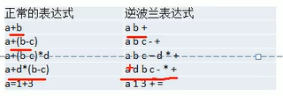

#### 8.10.1 计算求值

从左至右扫描表达式，遇到数字时，将数字压入堆栈，遇到运算符时，弹出栈顶的两个数，用运算符对它们做相应的计算（次顶元素和栈顶元素），并将结果入栈；重复上述过程直到表达式最右端，最后运算得出的值即为表达式的结果

例如：(3+4)x5-6对应的前缀表达式就是34+5x6-，针对后缀表达式求值步骤如下：

1. 从左至右扫描，将3和4压入堆栈；
2. 遇到+运算符，因此弹出4和3（4为栈顶元素，3为次顶元素），计算出3+4的值，得7，再将7入栈；
3. 将5入栈
4. 接下来时x运算符，因此弹出5和7，计算出7x5=35，将35入栈
5. 将6入栈
6. 最后是-运算符，计算出35-6的值，即29，由此得出最终结果

#### 8.10.2 代码实现

```java
package com.company.stack;

import java.util.ArrayList;
import java.util.List;
import java.util.Stack;

/*计算逆波兰表达式*/
public class PolandNotation {
    public static void main(String[] args) {
        String suffixExpression = "3 4 + 5 * 6 -";
        List<String> list = stringToList(suffixExpression);
        int res = calculate(list);
        System.out.println("计算得出的结果为：" + res);
    }

    /**
     * 字符串转换成 List
     *
     * @param expression 后缀表达式
     * @return
     */
    public static List<String> stringToList(String expression) {
        String[] strings = expression.split(" ");
        ArrayList<String> list = new ArrayList<>();
        for (String elem : strings) {
            list.add(elem);
        }
        return list;
    }

    /**
     * 计算逆波兰表达式
     *
     * @param list
     * @return
     */
    public static int calculate(List<String> list) {
        Stack<String> stack = new Stack<>();
        int num1 = 0;
        int num2 = 0;
        int res = 0;
        for (String elem : list) {
            if (elem.matches("\\d+")) {
                stack.push(elem);
            } else {
                num2 = Integer.parseInt(stack.pop());
                num1 = Integer.parseInt(stack.pop());
                if (elem.equals("+")) {
                    res = num1 + num2;
                } else if (elem.equals("-")) {
                    res = num1 - num2;
                } else if (elem.equals("*")) {
                    res = num1 * num2;
                } else if (elem.equals("/")) {
                    res = num1 / num2;
                } else {
                    throw new RuntimeException("运算符错误");
                }
                stack.push("" + res);
            }
        }
        return Integer.parseInt(stack.pop());
    }
}
```

### 8.11 中缀表达式转后缀表达式

#### 8.11.1 思路步骤分析

1. 初始化两个栈：运算符栈s1和存储中间结果的栈s2
2. 从左至右扫描中缀表达式
3. 遇到操作数时，将其压入s2
4. 遇到运算符时，比较其与s1栈顶元素运算符的优先级
   1. 如果s1为空，或栈顶运算符为左括号"("，则直接将此运算符入栈
   2. 否则，若优先级比栈顶运算符的高，也将运算符压入s1
   3. 否则，将s1栈顶的运算符弹出并压入到s2中，再次转到4.1与s1中新的栈顶运算符相比较
5. 遇到括号时：
   1. 如果是左括号"("，则直接压入s1
   2. 如果是右括号")"，则依次弹出s1栈顶的运算符，并压入s2，直到遇到左括号为止，此时将这一对括号丢弃
6. 重复步骤2至5，直到表达式的最右边
7. 将s1中剩余的运算符依次弹入并压入s2
8. 依次弹出s2中的元素并输出，结果的逆序即为中缀表达式对应的后缀表达式

#### 8.11.2 代码实现

```java
/**
 * 将中缀表达式转成对应的List
 *
 * @param str
 * @return
 */
public static List<String> toInfixExpressionList(String str) {
    ArrayList<String> list = new ArrayList<>();
    int index = 0;
    String append;
    char c;
    do {
        if ((c = str.charAt(index)) < 48 || (c = str.charAt(index)) > 57) {
            list.add("" + c);
            index++;
        } else {
            append = "";
            while (index < str.length() && (c = str.charAt(index)) >= 48 && (c = str.charAt(index)) <= 57) {
                append += c;
                index++;
            }
            list.add(append);
        }
    } while (index < str.length());
    return list;
}

/**
     * 中缀表达式转后缀表达式
     *
     * @param list
     * @return
     */
    public static List<String> parseSuffixExpressionList(List<String> list) {
        Stack<String> s1 = new Stack<>();
        ArrayList<String> s2 = new ArrayList<>();
        for (String item : list) {
            //遇到操作数时，将其压入s2
            if (item.matches("\\d+")) {
                s2.add(item);
            } else if (item.equals("(")) {
                s1.push(item);
            } else if (item.equals(")")) {
                while (!s1.peek().equals("(")) {
                    s2.add(s1.pop());
                }
                s1.pop();
            } else if (isOperate(item)) {
                while (s1.size() != 0 && getPriority(item) <= getPriority(s1.peek())) {
                    s2.add(s1.pop());
                }
                s1.push(item);
            } else {
                throw new RuntimeException("输入的操作数或运算符有错");
            }
        }
        while (s1.size() != 0) {
            s2.add(s1.pop());
        }
        return s2;
    }

/**
     * 获取运算符优先级
     *
     * @param op
     * @return
     */
    public static int getPriority(String op) {
        final int ADD = 1;
        final int SUB = 1;
        final int MUL = 2;
        final int DIV = 2;
        int result = 0;
        switch (op) {
            case "+":
                result = ADD;
                break;
            case "-":
                result = SUB;
                break;
            case "*":
                result = MUL;
                break;
            case "/":
                result = DIV;
                break;
        }
        return result;
    }

/**
     * 判断是否为运算符
     *
     * @param op
     * @return
     */
    public static boolean isOperate(String op) {
        return "+".equals(op) || "-".equals(op) || "*".equals(op) || "/".equals(op);
    }
```

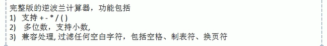

## 9 递归

### 9.1 解决迷宫问题

```
package com.company.recursion;

public class maze {
    public static void main(String[] args) {
        int[][] maze = new int[8][7];
        for (int i = 0; i < 7; i++) {
            maze[0][i] = 1;
            maze[7][i] = 1;
        }
        for (int i = 0; i < 8; i++) {
            maze[i][0] = 1;
            maze[i][6] = 1;
        }
        maze[3][1] = 1;
        maze[3][2] = 1;

        for (int i = 0; i < maze.length; i++) {
            for (int j = 0; j < maze[i].length; j++) {
                System.out.print(maze[i][j] + "  ");
            }
            System.out.println();
        }

        System.out.println("迷宫走路");
        getWay(maze, 1, 1);

        for (int i = 0; i < maze.length; i++) {
            for (int j = 0; j < maze[i].length; j++) {
                System.out.print(maze[i][j] + "  ");
            }
            System.out.println();
        }
    }

    public static boolean getWay(int[][] maze, int i, int j) {
        if (maze[6][5] == 2) {
            return true;
        } else {
            /*策略：下-》右-》上-》左*/
            if (maze[i][j] == 0) {
                maze[i][j] = 2;
                if (getWay(maze, i + 1, j)) {
                    return true;
                } else if (getWay(maze, i, j + 1)) {
                    return true;
                } else if (getWay(maze, i - 1, j)) {
                    return true;
                } else if (getWay(maze, i, j - 1)) {
                    return true;
                } else {
                    maze[i][j] = 3;
                    return false;
                }
            } else {
                return false;
            }
        }
    }
}
```

#### 9.1.1 如何求出最短路径？

### 9.2 八皇后问题

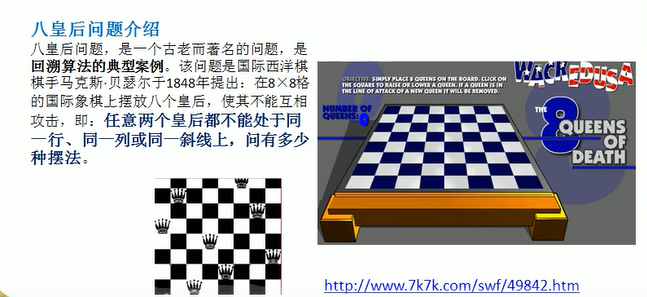

#### 9.2.1 思路分析

1. 第一个皇后先放在第一行第一列
2. 第二个皇后放在第二行第一列、然后判断是否OK，如果不OK，继续放在第二列、第三列、依次把所有列都放完，找到一个合适
3. 继续第三个皇后，还是第一列、第二列...直到第8个皇后也能放在一个不冲突的位置，算式找到了一个正确解
4. 当得到一个正确解时，在栈回退到上一个栈时，就会开始回溯，即将第一个皇后，放到第一列的所有正确解，全部得到
5. 然后回头继续第一个皇后方第二列，后面继续循环执行1，2，3，4的步骤

**说明：理论上应该创建一个二维数组来表示棋盘，但是实际上可以通过算法，用一个一维数组即可解决问题.arr[8]={0,4,7,5,2,6,1,3}**

#### 9.2.2 代码实现(不理解)

```java
package com.company.recursion;

public class queue8 {
    int max = 8;
    int[] array = new int[max];
    static int count = 0;

    public static void main(String[] args) {
        queue8 queue8 = new queue8();
        queue8.check(0);
        System.out.println("count=" + count);
    }

    public void check(int n) {
        if (n == max) {
            print();
            return;
        }

        for (int i = 0; i < max; i++) {
            array[n] = i;
            if (judge(n)) {
                check(n + 1);
            }
        }
    }

    public boolean judge(int n) {
        for (int i = 0; i < n; i++) {
            if (array[n] == array[i] || Math.abs(n - i) == Math.abs(array[n] - array[i])) {
                return false;
            }
        }
        return true;
    }

    public void print() {
        count++;
        for (int i = 0; i < array.length; i++) {
            System.out.print(array[i] + " ");
        }
        System.out.println();
    }
}
```

## 10 排序算法和分类

排序也称排序算法，排序是将一组数据，依指定的顺序进行排列的过程。

### 10.1 排序的分类

1. 内部排序

   指将需要处理的所有数据都加载到内部存储器中进行排序。

2. 外部排序

   数据量过大，无法全部加载到内存中，需要借助外部存储进行排序

### 10.2 常见的排序算法分类

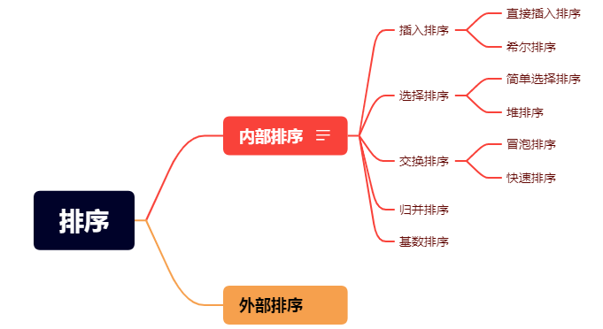

### 10.3 算法的时间复杂度

#### 10.3.1 时间复杂度

1. 一般情况下，算法中的基本操作语句的重复执行次数是问题规模n的某个函数，用T(n)表示，若有某个辅助函数f(n)，使得当n趋近于无穷大时，T(n)/f(n)的极限值为不等于零的常数，则称f(n)是T(n)的同数量级函数，记作T(n)=O(f(n))，称O(f(n))为算法的渐进时间复杂度，简称时间复杂度。
2. T(n)不同，但时间复杂度可能相同。如：`T(n)=n^2+7n+6与T(n)=3n^2+2n+2它们的T(n)不同，但时间复杂度相同，都为O(n^2).
3. 计算时间复杂度的方法：
   - 用常数1代替运行时间中的所有加法常数
   - 修改后的运行次数函数中，只保留最高阶项
   - 去除最高阶项的系数

#### 10.3.2 平均时间复杂度和最坏时间复杂度

1. 平均时间复杂度是指所有可能的输入实例均以等概率出现的情况下，该算法的运行时间。

2. 最坏情况下的时间复杂度称最坏时间复杂度。一般讨论的时间复杂度均是最坏情况下的时间复杂度。这样做的原因是：最坏情况下的时间复杂度是算法在任何输入实例上运行时间的界限，这就保证了算法的运行时间不会比最坏情况更长。

3. 平均时间复杂度和最坏时间复杂度是否一致，和算法有关，如表：

   | 排序法 | 平均时间    | 最差情形       | 稳定度 | 额外空间   | 备注                              |
   | ------ | ----------- | -------------- | ------ | ---------- | --------------------------------- |
   | 冒泡   | O($n^2 $)   | O($n^2$)       | 稳定   | O(1)       | n小时较好                         |
   | 交换   | O($n^2$)    | O($n^2 $)      | 不稳定 | O(1)       | n小时较好                         |
   | 选择   | O($n^2$)    | O($n^2$)       | 不稳定 | O(1)       | n小时较好                         |
   | 插入   | O($n^2$)    | O($n^2$)       | 稳定   | O(1)       | 大部分已排序好时较好              |
   | 基数   | O($log_RB$) | O($log_RB$)    | 稳定   | O(n)       | B是真数（0-9），R是基数（个十百） |
   | Shell  | O($nlogn$)  | O($n^s$) 1<s<2 | 不稳定 | O(1)       | s是所选分组                       |
   | 快速   | O($nlogn$)  | O($n^2$)       | 不稳定 | O($nlogn$) | n大时较好                         |
   | 归并   | O($nlogn$)  | O($nlogn$)     | 稳定   | O(1)       | n大时较好                         |
   | 堆     | O($nlogn$)  | O($nlogn$)     | 不稳定 | O(1)       | n大时较好                         |


### 10.4 冒泡排序

#### 10.4.1 基本介绍

#### 10.4.2 排序思想

通过对待排序序列从前向后（从下标较小的元素开始），依次比较相邻元素的值，若发现逆序则交换，使值较大的元素逐渐从前移向后部，就像水底下的气泡一样逐渐向上冒。

#### 10.4.3 代码实现

```java
package com.company.sortalgorithm;

public class BubbleSortDemo {
    public static void main(String[] args) {
        int[] array = {20, -1, 10, 5, 9};
        System.out.println("冒泡排序前：");
        for (int i = 0; i < array.length; i++) {
            System.out.print(array[i] + " ");
        }
        System.out.println("冒泡排序后：");
        bubbleSort(array);
        for (int i = 0; i < array.length; i++) {
            System.out.print(array[i] + " ");
        }
    }

    /**
     * 冒泡排序
     * 升序
     *
     * @param array
     */
    public static void bubbleSort(int[] array) {
        for (int i = 0; i < array.length - 1; i++) {
            for (int j = i + 1; j < array.length; j++) {
                if (array[i] > array[j]) {
                    swap(array, i, j);
                }
            }
        }
    }

    private static void swap(int[] array, int i, int j) {
        int temp = array[i];
        array[i] = array[j];
        array[j] = temp;
    }
}
```

#### 10.4.4 优化

思想：因为排序过程中，各元素不断接近自己的位置，如果一趟比较下来没有进行过交换，就说明有序，因此要在排序过程中设置一个标志flag判断元素是否进行过交换，从而减少不必要的比较。

```java
/**
 * 冒泡排序算法优化
 * @param array
 */
public static void bubbleSortOpt(int[] array) {
    boolean flag = true;
    for (int i = 0; i < array.length - 1 && flag; i++) {
        flag = false;
        for (int j = i + 1; j < array.length; j++) {
            if (array[i] > array[j]) {
                swap(array, i, j);
                flag = true;
            }
        }
    }
}
```

### 10.5 选择排序

#### 10.5.1 基本介绍

选择排序也属于内部排序法，是从欲排序的数据中，按照指定的规则选出某一元素，再依规定交换位置后达到排序的目的。

#### 10.5.2 排序思想

选择排序（select sorting）也是一种简单的排序方法。它的基本思想是：第一次从arr[0]~arr[n-1]中选取最小值，与arr[0]交换，第二次从arr[1]~arr[n-1]中选取最小值，与arr[1]交换，···，第i次从arr[i-1]~arr[n-1]中选取最小值，与arr[i-1]交换，···，第n-1次从arr[n-2]~arr[n-1]中选取最小值，与arr[n-2]交换，总共通过n-1次，得到一个按排序码从小到大排序的有序序列。

#### 10.5.3 代码实现

```java
package com.company.sortalgorithm;

public class selectSortDemo {
    public static void main(String[] args) {
        int[] array = new int[]{20, -1, 10, 5, 9};
        System.out.println("选择排序前：");
        for (int i = 0; i < array.length; i++) {
            System.out.print(array[i] + " ");
        }
        System.out.println();
        System.out.println("选择排序后：");
        selectSort(array);
        for (int i = 0; i < array.length; i++) {
            System.out.print(array[i] + " ");
        }
    }

    /**
     * 选择排序
     * 升序
     *
     * @param array
     */
    public static void selectSort(int[] array) {
        int minIndex;
        for (int i = 0; i < array.length - 1; i++) {
            minIndex = i;
            for (int j = i + 1; j < array.length; j++) {
                if (array[minIndex] < array[j]) {
                    minIndex = j;
                }

                if (i != minIndex) {
                    swap(array, i, minIndex);
                }
            }
        }
    }

    private static void swap(int[] array, int i, int j) {
        int temp = array[i];
        array[i] = array[j];
        array[j] = temp;
    }
}
```

### 10.6 插入排序

#### 10.6.1 基本介绍

插入排序属于内部排序法，是对欲排序的元素以插入的方式找该元素的适当位置，以达到排序的目的。

#### 10.6.2 排序思想

插入排序（Insertion Sorting）的基本思想是：把n个待排序的元素看成为一个有序表和一个无序表，开始时有序表中只包含一个元素，无序表中包含n-1个元素，排序过程中每次从无序表中取出第一个元素，把它的排序码依次与有序表元素的排序码进行比较，将它插入到有序表中的适当位置，使之成为新的有序表。

#### 10.6.3 代码实现

```java
package com.company.sortalgorithm;

public class InsertSortDemo {
    public static void main(String[] args) {
        int[] array = new int[]{20, -1, 10, 5, 9};
        System.out.println("插入排序前：");
        for (int i = 0; i < array.length; i++) {
            System.out.print(array[i] + " ");
        }
        System.out.println();
        System.out.println("插入排序后：");
        insertSort(array);
        for (int i = 0; i < array.length; i++) {
            System.out.print(array[i] + " ");
        }
    }

    /**
     * 插入排序
     *
     * @param array
     */
    public static void insertSort(int[] array) {
        int insertValue;
        int insertIndex;
        for (int i = 1; i < array.length; i++) {
            insertValue = array[i];
            insertIndex = i - 1;
            while (insertIndex >= 0 && insertValue < array[insertIndex]) {
                array[insertIndex + 1] = array[insertIndex];
                insertIndex--;
            }
            if (insertIndex + 1 != i) {
                array[insertIndex + 1] = insertValue;
            }
        }
    }
}
```

### 10.7 希尔排序

#### 10.7.1 基本介绍

[视频讲解](https://www.bilibili.com/video/BV1BK4y1478X?spm_id_from=333.337.search-card.all.click&vd_source=00e94ed7bf22d8ca9a98aa1b575f3b16)

希尔排序是希尔（Donald Shell）于1959年提出的一种排序算法。希尔排序也是一种插入排序。它是简单插入排序经过改进之后的一个更高效的版本，也称为缩小增量排序。

#### 10.7.2 排序思想

希尔排序是把记录按下标的一定增量分组，对每组使用直接插入排序算法排序；随着增量逐渐减少，每组包含的关键词越来越多，当增量减至1时，整个文件恰好被分成一组，算法便终止。

#### 10.7.3 代码实现

```java
package com.company.sortalgorithm;

import java.util.Arrays;

public class ShellSortDemo
{
    public static void main(String[] args)
    {
        int[] array = new int[]{8, 9, 1, 7, 2, 3, 5, 4, 6, 0};
        shellSort(array);
        System.out.println(Arrays.toString(array));
    }

    /**
     * 希尔排序
     *
     * @param array
     */
    public static void shellSort(int[] array)
    {
        int i, j, inc, key;
        for (inc = array.length / 2; inc > 0; inc /= 2)
        {
            for (i = inc; i < array.length; i++)
            {
                key = array[i];
                for (j = i; j >= inc && key < array[j - inc]; j -= inc)
                    array[j] = array[j - inc];
                array[j] = key;
            }
        }
    }
}
```

### 10.8 快速排序

#### 10.8.1 基本介绍

快速排序（QuickSort）是对冒泡排序的一种改进。基本思想是，通过·一趟排序将要排序的数据分割成独立的两部分，其中一部分的所有数据都比另外一部分的所有数据都要小，然后再按此方法对这两部分数据分别进行快速排序，整个排序过程可以递归进行，以此达到整个数据变成有序序列。

#### 10.8.2 代码实现

```java
package com.company.sortalgorithm;

import java.util.Arrays;

public class QuickSortDemo
{
    public static void main(String[] args)
    {
        QuickSortDemo demo = new QuickSortDemo();
        int[] arr = {8, 7, 1, 4, 3, 5};
        demo.quick_sort(arr);
        System.out.println(Arrays.toString(arr));
    }

    /**
     * 快速排序,划分
     *
     * @param arr
     * @param low  最左边索引
     * @param high 最右边索引
     * @return int 划分位置
     */
    int partition(int[] arr, int low, int high)
    {
        int pivot = arr[high];
        int i = low;
        for (int j = low; j < high; j++)
        {
            if (arr[j] < pivot)
            {
                swap(arr, i, j);
                i++;
            }
        }
        swap(arr, i, high);
        return i;
    }

    void qsort(int[] arr, int low, int high)
    {
        if (low < high)
        {
            int mid = partition(arr, low, high);
            qsort(arr, low, mid - 1);
            qsort(arr, mid + 1, high);
        }
    }

    void quick_sort(int[] arr)
    {
        qsort(arr, 0, arr.length - 1);
    }

    public void swap(int[] arr, int i, int j)
    {
        int temp = arr[i];
        arr[i] = arr[j];
        arr[j] = temp;
    }
}
```

### 10.9 归并排序

#### 10.9.1 基本介绍

归并排序（MERGE-SORT）是利用归并的思想实现的排序方法，该算法采用经典的分治（divide-and-conquer）策略（分治法将问题分成一些小的问题然后递归求解，而治的阶段则将分的阶段得到的各答案修补在一起，即分而治之）。

#### 10.9.2 代码实现

```java
package com.company.sortalgorithm;

import java.util.Arrays;

public class MergeSortDemo
{
    public static void main(String[] args)
    {
        int[] arr = new int[]{8, 4, 5, 7, 1, 3, 6, 2};
        int[] temp = new int[arr.length];
        mergeSort(arr, 0, arr.length - 1, temp);
        System.out.println(Arrays.toString(arr));
    }

    public static void mergeSort(int[] arr, int left, int right, int[] temp)
    {
        if (left < right)
        {
            int mid = (left + right) / 2;
            mergeSort(arr, left, mid, temp);
            mergeSort(arr, mid + 1, right, temp);
            merge(arr, left, mid, right, temp);
        }
    }

    /**
     * 合并方法
     *
     * @param arr
     * @param left
     * @param mid
     * @param right
     * @param temp
     */
    public static void merge(int[] arr, int left, int mid, int right, int[] temp)
    {
        int i = left;
        int j = mid + 1;
        int t = 0;
        while (i <= mid && j <= right)
        {
            if (arr[i] <= arr[j])
            {
                temp[t] = arr[i];
                t++;
                i++;
            } else
            {
                temp[t] = arr[j];
                j++;
                t++;
            }
        }
        while (i <= mid)
        {
            temp[t] = arr[i];
            t++;
            i++;
        }
        while (j <= right)
        {
            temp[t] = arr[j];
            j++;
            t++;
        }

        //将temp元素拷贝到arr
        t = 0;
        int tempLeft = left;
        System.out.println("tempLeft=" + tempLeft + "right=" + right);
        while (tempLeft <= right)
        {
            arr[tempLeft] = temp[t];
            t++;
            tempLeft++;
        }
    }
}
```

### 10.10 基数排序

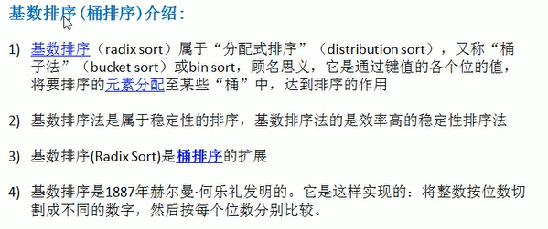

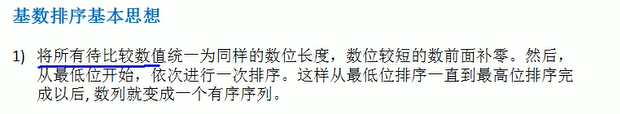

#### 10.10.1 基本介绍

1. 基数排序（radix sort）属于“分配式排序”，又称“桶子法”，

#### 10.10.2 代码实现

```java
package com.company.sortalgorithm;

import java.util.Arrays;

public class RadixSortDemo
{
    public static void main(String[] args)
    {
        int[] array = new int[]{201, 1, 10, 5, 9};
        radixSort(array, array.length);
        System.out.println(Arrays.toString(array));
    }

    public static void radixSort(int[] arr, int length)
    {
        int i, max = arr[0], base = 1;
        /*1.找出数组中最大的数*/
        for (i = 1; i < length; i++)
        {
            if (arr[i] > max)
            {
                max = arr[i];
            }
        }
        int[] temp = new int[length];

        while (max / base > 0)
        {
            int[] bucket = new int[10];
            for (i = 0; i < length; i++)
            {
                bucket[arr[i] / base % 10]++;
            }
            for (i = 1; i < 10; i++)
            {
                bucket[i] += bucket[i - 1];
            }
            for (i = length - 1; i >= 0; i--)
            {
                temp[bucket[arr[i] / base % 10] - 1] = arr[i];
                bucket[arr[i] / base % 10]--;
            }
            for (i = 0; i < length; i++)
            {
                arr[i] = temp[i];
            }
            base = base * 10;
        }
    }
}
```

### 10.11 堆排序

## 11 查找算法

### 11.1 查找算法介绍

在java中，我们常用的查找有四种：

1. 顺序查找（线性）查找
2. 二分查找/折半查找
3. 插值查找
4. 斐波那契查找

### 11.2 线性查找算法

```java
package com.company.searchalgorithm;

public class seqSearchDemo
{
    public static void main(String[] args)
    {
        int[] array=new int[]{1,4,7,5,2,3};
        System.out.println(seqSearch(array, 7));
    }

    public static int seqSearch(int[] array, int val)
    {
        for (int i = 0; i < array.length; i++)
        {
            if (array[i] == val)
            {
                return i;
            }
        }
        return -1;
    }
}
```

### 11.3 二分查找

```java
package com.company.searchalgorithm;

public class BinarySearchDemo
{
    public static void main(String[] args)
    {
        int[] arr = new int[]{1, 4, 6, 8, 10, 14, 23};
        System.out.println(binarySearch(arr, 0, arr.length - 1, 4));
    }

    public static int binarySearch(int[] arr, int left, int right, int val)
    {
        if (left > right)
            return -1;
        int mid = (left + right) / 2;
        if (val > arr[mid])
        {
            return binarySearch(arr, mid + 1, right, val);
        } else if (val < arr[mid])
        {
            return binarySearch(arr, left, mid - 1, val);
        } else
        {
            return mid;
        }

    }
}
```

有多个相同的数值时，将所有的数值都查找到

```java
public static List binarySearch2(int[] arr, int left, int right, int val)
{
    if (left > right)
        return new ArrayList();
    int mid = (left + right) / 2;
    if (val > arr[mid])
    {
        return binarySearch2(arr, mid + 1, right, val);
    } else if (val < arr[mid])
    {
        return binarySearch2(arr, left, mid - 1, val);
    } else
    {
        ArrayList<Integer> list = new ArrayList<>();
        int temp = mid - 1;
        while (true)
        {
            if (temp < 0 || arr[temp] != val)
                break;
            list.add(temp);
            temp--;
        }
        list.add(mid);
        temp = mid + 1;
        while (true)
        {
            if (temp > arr.length - 1 || arr[temp] != val)
                break;
            list.add(temp);
            temp++;
        }
        return list;
    }
}
```

### 11.4 插值查找

#### 11.4.1 原理介绍

1. 插值查找算法类似于二分查找，不同的是插值查找每次从自适应mid初开始查找。

2. 将折半查找中的求mid索引的公式，low表示左边索引，high表示右边索引

   $mid=\frac{low+high}{2}=low+\frac{1}{2}(high-low)$改成-->$mid=low+\frac{key-a[low]}{a[high]-a[low]}(high-low)$

3. $mid=low+(high-low)*(key-a[low])/(arr[high]-arr[low])$

#### 11.4.2 代码实现

```java
package com.company.searchalgorithm;

public class InsertSearchDemo
{
    public static void main(String[] args)
    {
        int[] arr = new int[]{1, 4, 6, 8, 10, 13, 14, 23};
        System.out.println(insertSearch(arr, 0, arr.length - 1, 13));
    }

    /**
     * 插值查找
     * @param arr
     * @param left
     * @param right
     * @param val
     * @return
     */
    public static int insertSearch(int[] arr, int left, int right, int val)
    {
        System.out.println("count");
        if (left > right || val < arr[left] || val > arr[right])
            return -1;
        int mid = left + (right - left) * (val - arr[left]) / (arr[right] - arr[left]);
        if (val < arr[mid])
            return insertSearch(arr, left, mid - 1, val);
        else if (val > arr[mid])
            return insertSearch(arr, mid + 1, right, val);
        else
            return mid;
    }
}
```

#### 11.4.3 注意事项

1. 对于数据量较大，关键字分布比较均匀的查找表来说，采用插值查找，速度较快
2. 关键字分布不均匀的情况下，该方法不一定比这般查找要好

### 11.5 斐波那契（黄金分割法）查找

## 12 哈希表

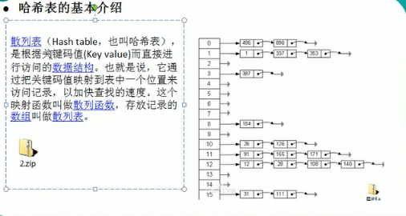

### 12.1 基本介绍

散列表（Hash table，也叫哈希表），是根据关键码值（Key value）而直接进行访问的数据结构。也就是说，它通过把关键码值映射到表中的一个位置来访问记录，以加快查找的速度。这个映射函数叫做散列函数，存放记录的数组叫做散列表。

### 12.2 内存结构

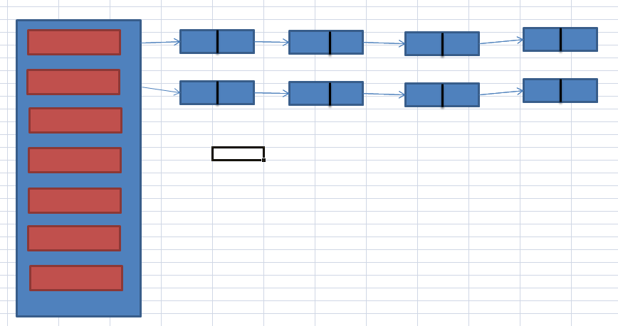

### 12.3 代码实现

```java
package com.company.hashtable;

public class HashTableDemo
{
    public static void main(String[] args)
    {
        HashTab hashTab = new HashTab();
        hashTab.add(new Stu(1, "jack1"));
        hashTab.add(new Stu(2, "jack2"));
        hashTab.add(new Stu(3, "jack3"));
        hashTab.add(new Stu(7, "jack7"));
        hashTab.add(new Stu(0, "jack0"));
        hashTab.list();

        hashTab.findById(2);
        hashTab.findById(8);
    }

}

class HashTab
{
    private int size = 10;
    StuLinkedList[] stuLinkedLists;

    public HashTab()
    {
        stuLinkedLists = new StuLinkedList[this.size];
        for (int i = 0; i < size; i++)
            stuLinkedLists[i] = new StuLinkedList();
    }

    public HashTab(int size)
    {
        this.size = size;
        stuLinkedLists = new StuLinkedList[size];
        for (int i = 0; i < size; i++)
            stuLinkedLists[i] = new StuLinkedList();
    }

    /*hash表添加元素*/
    public void add(Stu stu)
    {
        int no = hashCp(stu.getId());
        stuLinkedLists[no].add(stu);
    }

    /*遍历hash表*/
    public void list()
    {
        for (int i = 0; i < size; i++)
        {
            stuLinkedLists[i].list(i);
        }
    }

    /*hash表查找*/
    public void findById(int no)
    {
        int index = no % size;
        StuLinkedList list = stuLinkedLists[index];
        Stu temp = list.head;
        boolean flag = false;
        while (temp != null)
        {
            if (temp.getId() == no)
            {
                flag = true;
                break;
            }
            if (temp.next == null)
                break;
            temp = temp.next;
        }
        if (flag)
            System.out.println("第" + index + "链表," + "id=" + temp.getId() + "name=" + temp.getName());
        else
            System.out.println("不存在该id:" + no);


    }

    /*计算hash值,采用取模方法*/
    public int hashCp(int no)
    {
        return no % size;
    }

}

class StuLinkedList
{
    Stu head;

    public StuLinkedList()
    {
        head = null;
    }

    public void add(Stu stu)
    {
        if (head == null)
        {
            head = stu;
            return;
        }
        Stu temp = head;
        while (temp.next != null)
        {
            temp = temp.next;
        }
        temp.next = stu;
    }

    public void list(int no)
    {
        if (head == null)
        {
            System.out.println("链表为空");
            return;
        }
        Stu temp = head;
        System.out.print(no + "链表信息为");
        while (temp != null)
        {
            System.out.printf("--->%d:%s", temp.getId(), temp.getName());
            temp = temp.next;
        }
        System.out.println();
    }

}

class Stu
{
    private int id;
    private String name;
    public Stu next;

    public Stu(int id, String name)
    {
        this.id = id;
        this.name = name;
    }

    public int getId()
    {
        return id;
    }

    public void setId(int id)
    {
        this.id = id;
    }

    public String getName()
    {
        return name;
    }

    public void setName(String name)
    {
        this.name = name;
    }
}
```